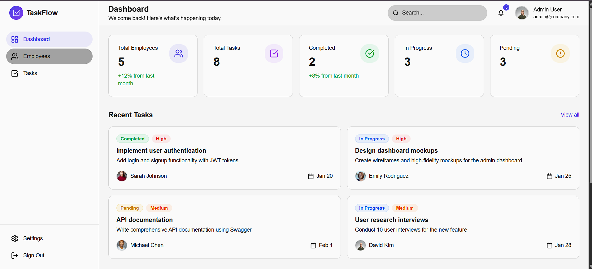
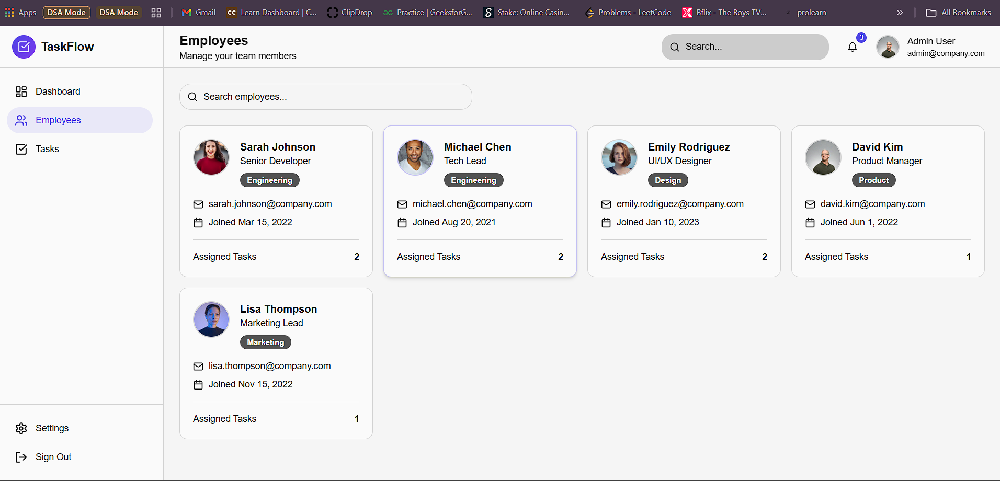
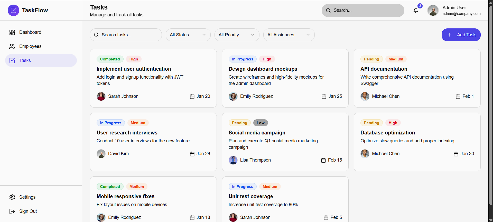
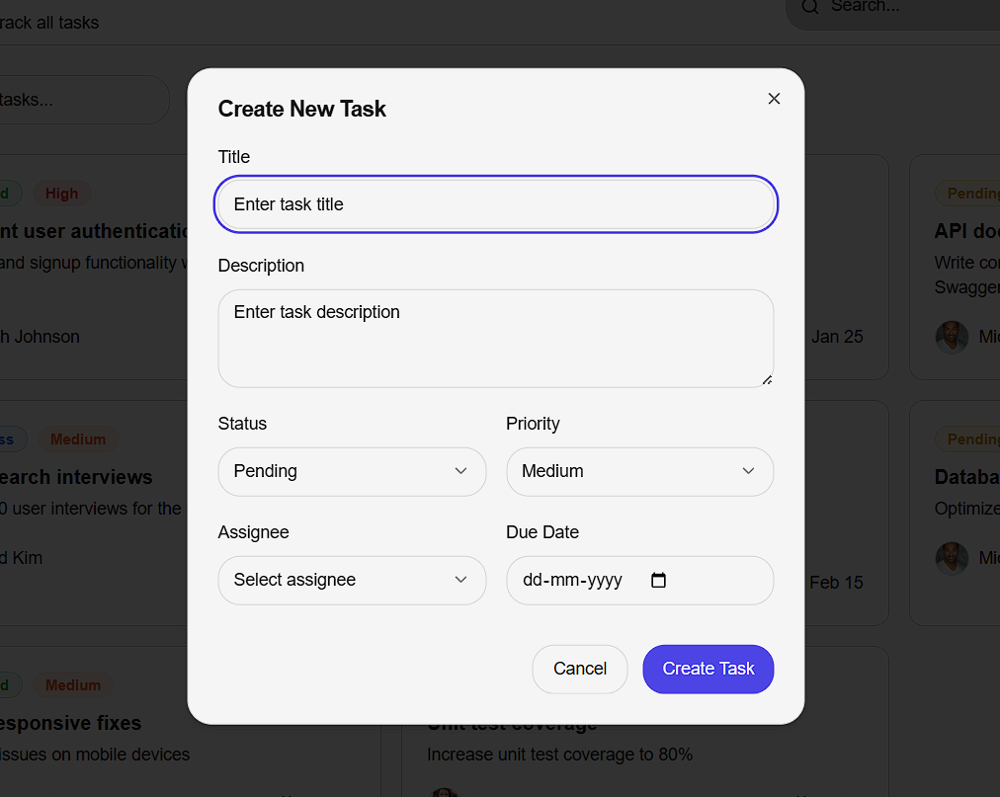

# Document Explorer

A modern task and employee management system built with React and TypeScript. This application provides a comprehensive dashboard for managing team members, tracking tasks, and monitoring project progress.

## 📋 Table of Contents

- [Features](#features)
- [Tech Stack](#tech-stack)
- [Screenshots](#screenshots)
- [Getting Started](#getting-started)
- [Backend API Configuration](#backend-api-configuration)
- [Project Structure](#project-structure)
- [Development](#development)

## ✨ Features

### Dashboard
- **Overview Statistics**: Real-time metrics for employees, tasks, and completion rates
- **Task Distribution**: Visual representation of task status distribution
- **Top Contributors**: Display of team members with their task completion rates
- **Recent Tasks**: Quick view of the latest tasks

### Employee Management
- **Employee Directory**: Browse and search through all team members
- **Employee Profiles**: View detailed information including department, position, and contact details
- **Task Assignment Tracking**: See how many tasks are assigned to each employee

### Task Management
- **Task Creation & Editing**: Create and update tasks with detailed information
- **Advanced Filtering**: Filter tasks by status, priority, assignee, and search terms
- **Status Management**: Update task status (Pending, In Progress, Completed)
- **Priority Levels**: Assign and filter by priority (Low, Medium, High)
- **Due Date Tracking**: Monitor task deadlines

## 🛠️ Tech Stack

### Frontend
- **React 18** - UI library
- **TypeScript** - Type safety
- **Vite** - Build tool and dev server
- **React Router** - Client-side routing
- **TanStack Query (React Query)** - Data fetching and caching
- **shadcn/ui** - UI component library
- **Tailwind CSS** - Styling
- **Lucide React** - Icons
- **date-fns** - Date formatting

### Development Tools
- **ESLint** - Code linting
- **TypeScript ESLint** - TypeScript-specific linting rules
- **PostCSS** - CSS processing
- **Autoprefixer** - CSS vendor prefixing

## 📸 Screenshots

### Dashboard View
<!-- Add your dashboard screenshot here -->


### Employees Page
<!-- Add your employees page screenshot here -->


### Tasks Page
<!-- Add your tasks page screenshot here -->


### Task Creation Modal
<!-- Add your task creation modal screenshot here -->


## 🚀 Getting Started

### Prerequisites

- **Node.js** (v18 or higher) - [Download](https://nodejs.org/)
- **npm** or **yarn** package manager

### Installation

1. **Clone the repository**
   ```bash
   git clone <YOUR_GIT_URL>
   cd document-explorer
   ```

2. **Install dependencies**
   ```bash
   npm install
   ```

3. **Start the development server**
   ```bash
   npm run dev
   ```

4. **Open your browser**
   Navigate to `http://localhost:8080` to view the application

## 🔌 Backend API Configuration

The application is currently configured to use **mock data** for demonstration purposes. To connect to a real backend API, follow these steps:

### API Configuration

The API configuration is located in `src/services/api.ts`. Update the following:

```typescript
export const API_CONFIG = {
  baseUrl: import.meta.env.VITE_API_BASE_URL || '',
  apiKey: import.meta.env.VITE_API_KEY || '',
  useMockData: false, // Set to false when backend is ready
};
```

### Environment Variables

Create a `.env` file in the root directory:

```env
VITE_API_BASE_URL=https://your-api-url.com/api
VITE_API_KEY=your-api-key-here
```

### API Endpoints

The application expects the following REST API endpoints:

#### Tasks API
- `GET /tasks` - Fetch all tasks (supports query params: `status`, `priority`, `assigneeId`, `search`)
- `GET /tasks/:id` - Fetch a single task
- `POST /tasks` - Create a new task
- `PUT /tasks/:id` - Update a task
- `PATCH /tasks/:id/status` - Update task status
- `DELETE /tasks/:id` - Delete a task
- `GET /tasks/stats` - Get task statistics

#### Employees API
- `GET /employees` - Fetch all employees
- `GET /employees/:id` - Fetch a single employee
- `POST /employees` - Create a new employee
- `PUT /employees/:id` - Update an employee
- `DELETE /employees/:id` - Delete an employee

### Data Models

#### Task
```typescript
{
  id: string;
  title: string;
  description: string;
  status: 'pending' | 'in-progress' | 'completed';
  priority: 'low' | 'medium' | 'high';
  assigneeId: string;
  dueDate: string; // ISO date string
  createdAt: string; // ISO date string
  updatedAt: string; // ISO date string
}
```

#### Employee
```typescript
{
  id: string;
  name: string;
  email: string;
  department: string;
  position: string;
  avatar?: string; // URL to avatar image
  joinedAt: string; // ISO date string
}
```

### Service Layer

The application uses a service layer pattern located in `src/services/`:

- **`api.ts`** - Base API configuration and request utilities
- **`taskService.ts`** - Task-related API calls
- **`employeeService.ts`** - Employee-related API calls

To integrate with your backend:

1. Update `src/services/api.ts` with your API base URL and authentication
2. Replace mock implementations in `taskService.ts` and `employeeService.ts` with actual API calls
3. Ensure your API responses match the expected data models

### Example Backend Integration

The service files include commented examples for integrating with:
- **Supabase** (PostgreSQL)
- **REST APIs**
- **GraphQL** (with minor modifications)

## 📁 Project Structure

```
document-explorer/
├── public/                 # Static assets
├── src/
│   ├── components/        # React components
│   │   ├── dashboard/     # Dashboard-specific components
│   │   ├── employees/     # Employee-related components
│   │   ├── layout/        # Layout components (Header, Sidebar)
│   │   ├── tasks/         # Task-related components
│   │   └── ui/            # Reusable UI components (shadcn/ui)
│   ├── data/              # Mock data
│   ├── hooks/             # Custom React hooks
│   ├── lib/               # Utility functions
│   ├── pages/             # Page components
│   ├── services/          # API service layer
│   ├── types/             # TypeScript type definitions
│   ├── App.tsx            # Main app component
│   ├── main.tsx           # Application entry point
│   └── index.css          # Global styles
├── index.html             # HTML template
├── package.json           # Dependencies and scripts
├── tsconfig.json          # TypeScript configuration
├── vite.config.ts         # Vite configuration
└── tailwind.config.ts     # Tailwind CSS configuration
```

## 💻 Development

### Available Scripts

- `npm run dev` - Start development server with hot reload
- `npm run build` - Build for production
- `npm run build:dev` - Build in development mode
- `npm run preview` - Preview production build locally
- `npm run lint` - Run ESLint to check code quality

### Code Style

The project uses ESLint for code quality. Run the linter before committing:

```bash
npm run lint
```

### Building for Production

```bash
npm run build
```

The production build will be output to the `dist/` directory.

## 📝 License

This project is private and proprietary.

---

**Note**: Currently using mock data. Configure the backend API as described above to connect to a real database.
